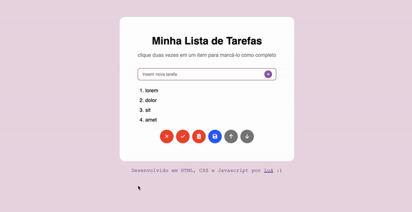

## To-Do List 📌:

## About:

Small project developed during the Web Development Fundamentals module at Trybe.

The goal was to create a to-do list app, where users would be able add items, change their order, mark them as completed and delete them. The list could also be saved to the localStorage, so the user doesn't lose their items when leaving the page.

It was made in HTML, CSS and pure Javascript ES6+.

You can <a href="https://luacomacento.github.io/todo-list/" target="_blank">click here</a> to check the current state of the application.

## Tools:
<ul>
  <li>HTML5</li>
  <li>CSS3</li>
  <li>JavaScript ES6+</li>
</ul>

## In works:
As of now, I am no longer working on this project.
